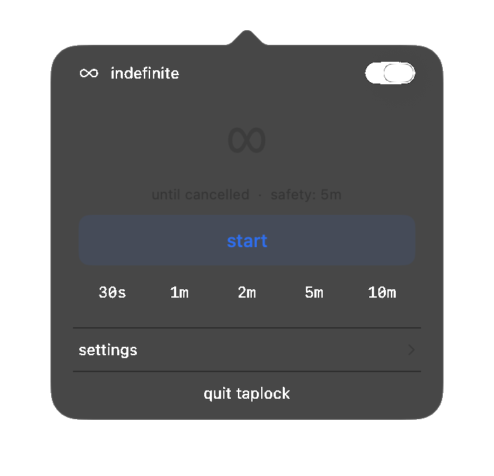
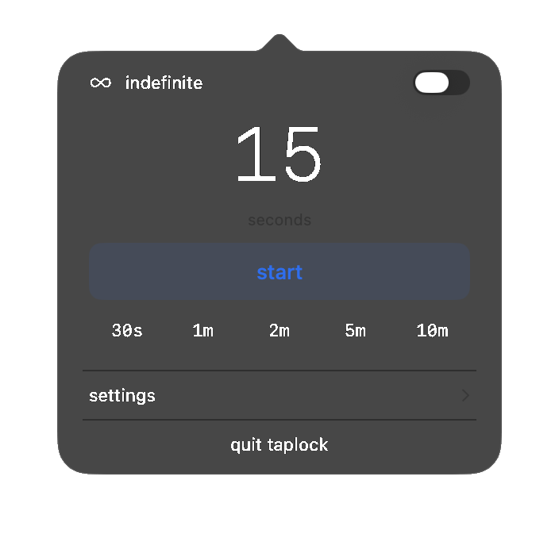
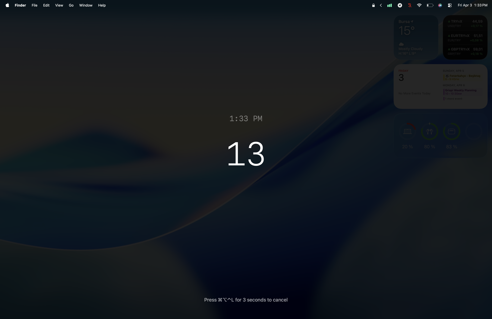

<div align="center">
  
  <h1>TapLock App</h1>
  <p>Menu bar app to temporarily disable keyboard and trackpad input on your Mac.</p>
  <br>
  <a href="https://github.com/ugurcandede/taplock-app/releases/latest"></a>
  <a href="https://github.com/ugurcandede/taplock-app/actions/workflows/build.yml"></a>
  <br>
  
  
  <a href="LICENSE"></a>
</div>

---

## Install

```bash
brew tap ugurcandede/taplock
brew install --cask taplock-app
```

---

## Features

| | Feature |
|---|---|
| 🔒 | Menu bar icon with lock status indicator |
| ⏱️ | Quick presets: 30s, 1m, 2m, 5m, 10m |
| 🔢 | Custom duration input (seconds) |
| ♾️ | Indefinite lock mode (5 min safety auto-unlock) |
| ⏳ | Pre-lock delay with visible countdown |
| ⌨️ | Keyboard only mode |
| 🎨 | Overlay color presets |
| 🔅 | Screen dimming |
| 🔇 | Silent mode |
| 🚨 | Emergency cancel: hold **⌘⌥⌃L** for 3 seconds |

---

## Screenshots

<div align="center">

| Indefinite Mode | Custom Duration | Settings |
|:---:|:---:|:---:|
|  |  |  |

**Lock Screen Overlay**



</div>

---

## Build from source

Requires Swift 5.9+. Uses [TapLock](https://github.com/ugurcandede/taplock) as a git submodule.

```bash
git clone --recurse-submodules https://github.com/ugurcandede/taplock-app.git
cd taplock-app
swift build -c release
./scripts/bundle.sh .build/release/TapLockApp
open TapLock.app
```

---

## Architecture

Built on `TapLockCore` from the [taplock](https://github.com/ugurcandede/taplock) package:

| Module | Purpose |
|---|---|
| **TapLockSession** | Session orchestration (start/cancel/onEnd) |
| **InputBlocker** | CGEvent tap for input blocking |
| **BrightnessControl** | Screen brightness control |
| **CountdownWindow** | Full-screen overlay with countdown |

---

## Requirements

macOS 13.0 (Ventura) or later · Apple Silicon or Intel · Accessibility permission

## Links

[Website](https://ugurcandede.github.io/taplock-app) · [CLI Repo](https://github.com/ugurcandede/taplock) · [Guide](https://ugurcandede.github.io/taplock-app/guide) · [FAQ](https://ugurcandede.github.io/taplock-app/faq)

## License

Source Available — free to use, not to modify or redistribute. See [LICENSE](LICENSE).
