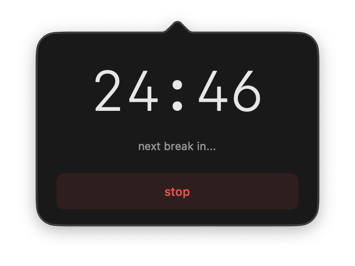
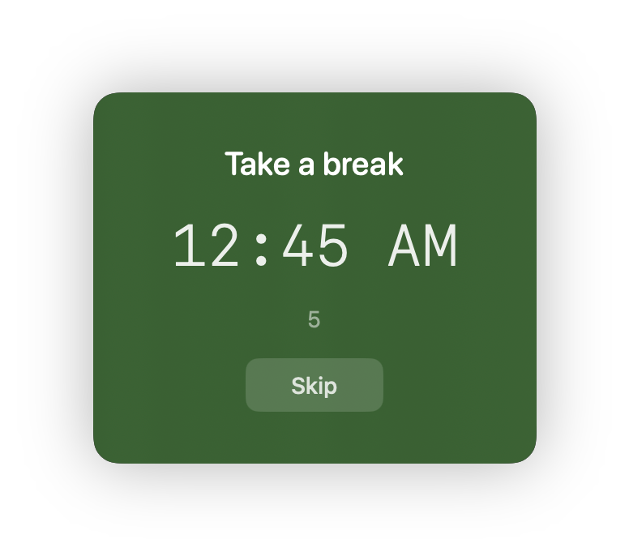
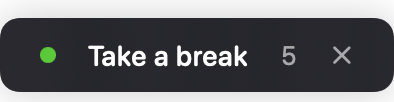

<div align="center">
  
  <h1>TapLock App</h1>
  <p>Menu bar app to temporarily disable keyboard and trackpad input, or take relaxing breaks on your Mac.</p>
  <br>
  <a href="https://github.com/ugurcandede/taplock-app/releases/latest"></a>
  <a href="https://github.com/ugurcandede/taplock-app/actions/workflows/build.yml"></a>
  <br>
  
  
  <a href="LICENSE"></a>
</div>

---
#### Releated
<p style="text-align: center">
  <a href="https://ugurcandede.github.io/taplock-app"></a>
  <a href="https://github.com/ugurcandede/taplock"></a>
  <a href="https://github.com/ugurcandede/homebrew-taplock"></a>
</p>

---

## Install

```bash
brew tap ugurcandede/taplock
brew install --cask taplock-app
```

---

## Features

| | Feature |
|---|---|
| 🔒 | **Lock Mode** — Menu bar icon with lock status indicator |
| ⏱️ | Quick presets: 30s, 1m, 2m, 5m, 10m |
| 🔢 | Custom duration input (seconds, minutes, hours) |
| ♾️ | Indefinite lock mode (5 min safety auto-unlock) |
| ⏳ | Pre-lock delay with visible countdown |
| ⌨️ | Keyboard only mode |
| 🧘 | **Relax Mode** — Periodic break reminders with calming overlays |
| 🎨 | Overlay color and transparency presets |
| 🔅 | Screen dimming |
| 🔇 | Silent mode |
| 🚨 | Emergency cancel: hold **⌘⌥⌃L** for 3 seconds |

---

## Lock Mode

<div align="center">

| Indefinite Mode | Custom Duration | Settings |
|:---:|:---:|:---:|
|  |  |  |

**Lock Screen Overlay**


</div>

---

## Relax Mode

<div align="center">

|                             Relax Setup                             |                                   Break Countdown                                    | Break Relaxing Countdown                                                                       |                               Relax Settings                                |
|:-------------------------------------------------------------------:|:------------------------------------------------------------------------------------:|------------------------------------------------------------------------------------------------|:---------------------------------------------------------------------------:|
|  |  |  |  |

**Overlay Themes**

| Minimal | Mini |
|:---:|:---:|
|  |  |

| Breathing | Breathing (dark) |
|:---:|:---:|
|  |  |

</div>

---

## Build from source

Requires Swift 5.9+. Uses [TapLock](https://github.com/ugurcandede/taplock) as a git submodule.

```bash
git clone --recurse-submodules https://github.com/ugurcandede/taplock-app.git
cd taplock-app
swift build -c release
./scripts/bundle.sh .build/release/TapLockApp
open TapLock.app
```

---

## Architecture

Built on `TapLockCore` from the [taplock](https://github.com/ugurcandede/taplock) package:

| Module | Purpose |
|---|---|
| **TapLockSession** | Lock session orchestration (start/cancel/onEnd) |
| **RelaxingSession** | Relaxing session with interval timer and break lifecycle |
| **InputBlocker** | CGEvent tap for input blocking |
| **BrightnessControl** | Screen brightness control |
| **CountdownWindow** | Full-screen lock overlay with countdown |
| **RelaxingWindow** | Relaxing overlay with breathing/minimal/mini themes |
| **ConfigStore** | JSON persistence for relaxing session config |

---

## Requirements

macOS 13.0 (Ventura) or later · Apple Silicon or Intel · Accessibility permission

## License

Source Available — free to use, not to modify or redistribute. See [LICENSE](LICENSE).
