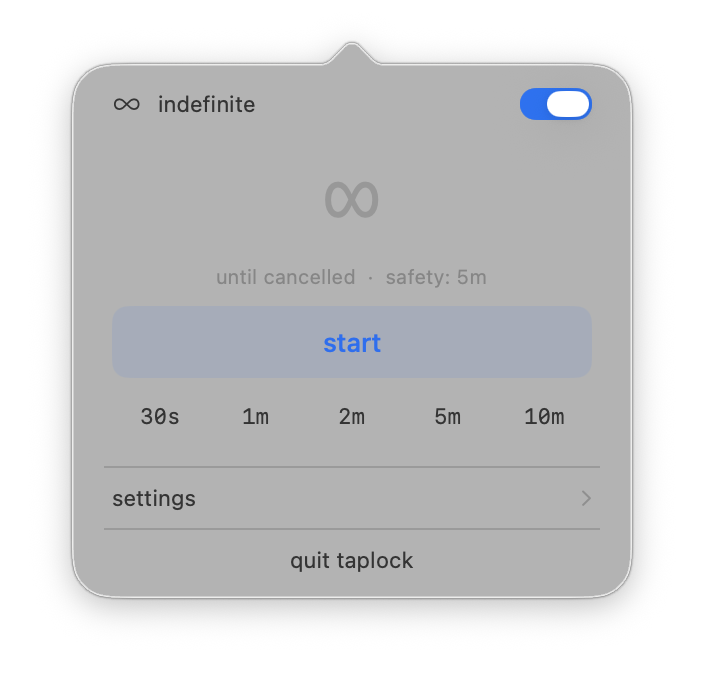
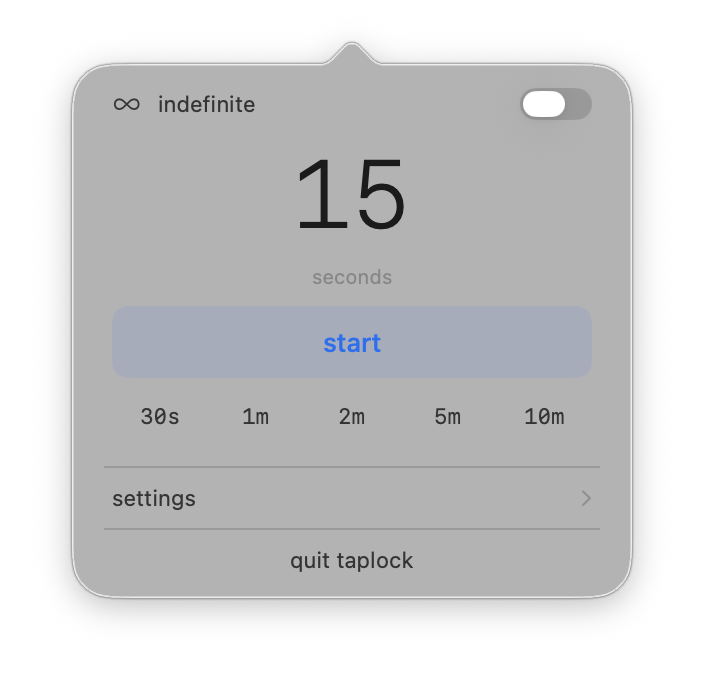
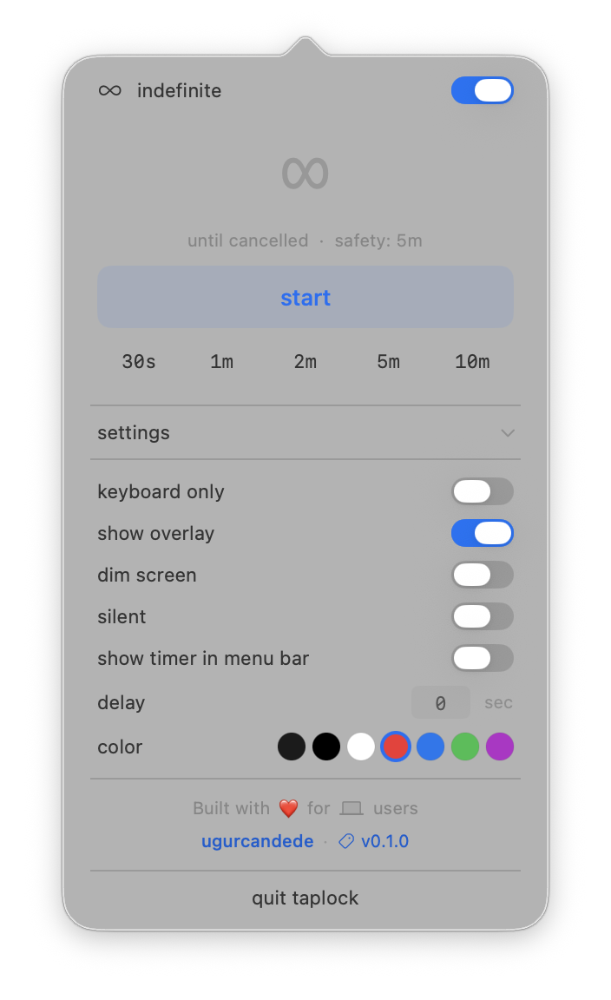
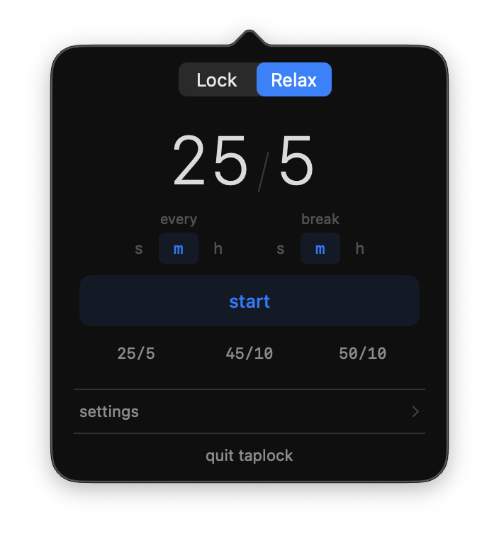
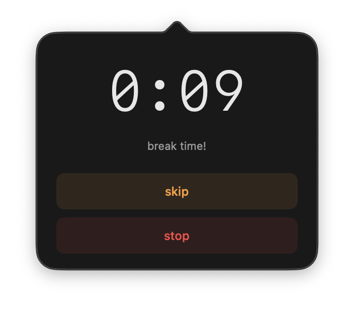
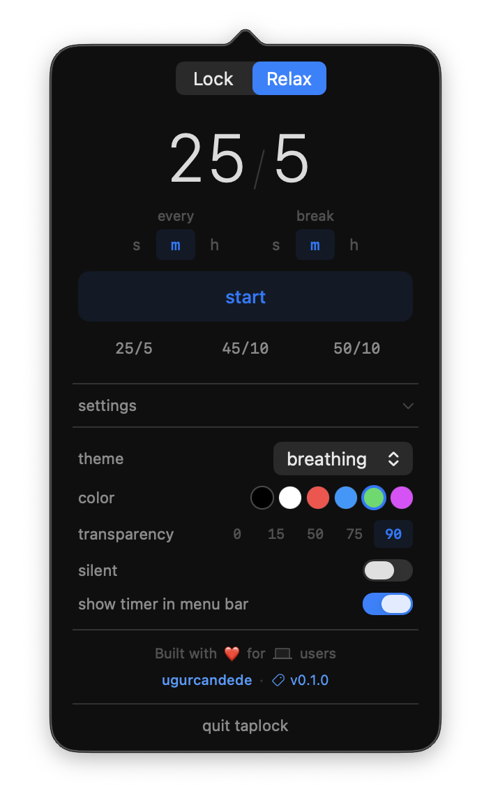
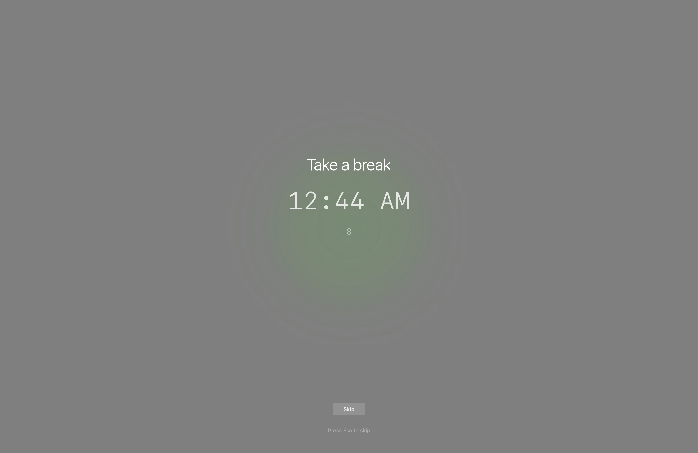
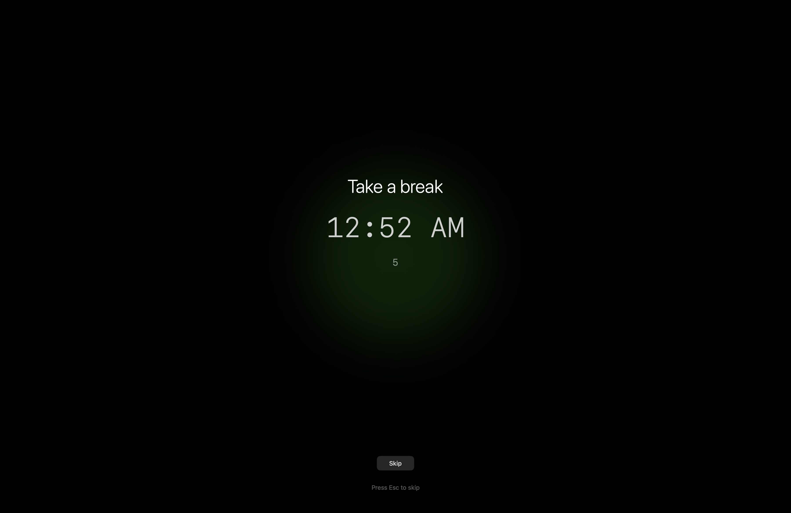

  
  <h1>TapLock</h1>
  
Temporarily disable keyboard and trackpad input, or take relaxing breaks on your Mac.

  
<strong>No root required.</strong>

  

    
    
    
    
  

  

    # Install via Homebrew 
    brew tap ugurcandede/taplock 
    brew install taplock              # CLI 
    brew install --cask taplock-app   # Menu bar app
  

---

  <h2>Features</h2>
  

    

      
⌨️

      <h3>Input Blocking</h3>
      
Block keyboard, trackpad, and mouse via CGEvent tap at system level.

    

    

      
⏱️

      <h3>Countdown Overlay</h3>
      
Full-screen timer with current clock display. Customizable background color.

    

    

      
♾️

      <h3>Flexible Duration</h3>
      
Set seconds, minutes, or lock indefinitely with 5-minute safety auto-unlock.

    

    

      
🔅

      <h3>Screen Dimming</h3>
      
Reduce brightness to minimum during lock. Automatically restores on unlock.

    

    

      
🔔

      <h3>Sound Feedback</h3>
      
Audio cues on lock start and end. Silent mode available.

    

    

      
🚨

      <h3>Emergency Cancel</h3>
      
Hold <strong>⌘⌥⌃L</strong> for 3 seconds to cancel any time — always works.

    

    

      
🧘

      <h3>Relaxing Sessions</h3>
      
Periodic break reminders with calming overlay themes. Pomodoro-style or custom intervals.

    

    

      
🔒

      <h3>No Root Required</h3>
      
Runs with standard user permissions. Only needs Accessibility access — no sudo, no admin.

    

    

      
💾

      <h3>Persistent Config</h3>
      
Save your relaxing session settings once. Next time, just run <code>taplock relax</code>.

    

  

---

  <h2>Lock Mode</h2>
  

    
    
    
  

  
  
Full-screen countdown overlay during active lock

---

  <h2>Relax Mode</h2>
  

    
    
    
    
  

  
<strong>Overlay Themes</strong>

  

    
    
  

  

    
    
  

---

  <h2>Two Ways to Use</h2>
  

    

      
💻

      <h3>CLI</h3>
      
Power user friendly. Full control from the terminal with all options and flags.

      <pre style="background:#1a1a2e;color:#e8e8e8;padding:12px;border-radius:8px;font-size:0.85em;margin-top:12px;">taplock 30 --dim --color black
taplock relax --every 25m --break 5m</pre>
    

    

      
🖱️

      <h3>Menu Bar App</h3>
      
Lock and Relax modes. Presets, custom input, theme selection — all from the menu bar.

    

  

---

  <h2>Links</h2>
  

    
    
    
  

---

  <h2>Requirements</h2>
  
macOS 13.0 (Ventura) or later · Apple Silicon or Intel · Accessibility permission

